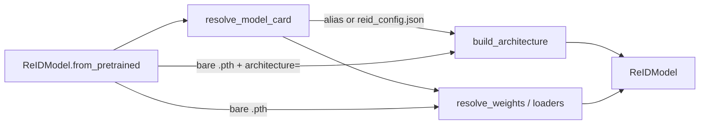

# ReID API

Requires the optional extra:

```bash
pip install 'trackers[reid]'
```

This page covers the standalone ReID stack (model loading, gallery evaluation,
and appearance helpers). Tracker association wiring is documented with BoT-SORT.

## Package layout

For contributors: the package splits three loading axes that look similar but
are not interchangeable.

| Area | Role |
| --- | --- |
| `architectures/` | Build a backbone (`osnet_*`, `timm:<name>`, or a raw `nn.Module`). |
| `models/registry.py` | Resolve *which* pretrained recipe to use: curated aliases and `reid_config.json` → `ModelCard`. |
| `models/loaders.py` | Fetch and load checkpoint bytes (`hf://`, `gd://`, local) into a module. |
| `models/preprocessing.py` | Crop resize / colour / embedding L2 contract. |
| `model.py` | Public facade: `ReIDModel.from_pretrained` / `save_pretrained` / `extract_features`. |
| `appearance.py` / `feature_bank.py` | Association helpers (cosine similarity, per-track EMA). |
| `eval/` | Gallery metrics and Market-1501 / MSMT17 loaders. |
| `encoder.py` | Lightweight protocols for custom encoders. |

**Common confusion:** the registry is not the architecture factory. Adding a
new backbone means teaching `build_architecture`. Shipping a one-line
pretrained name (for example `osnet_x1_0_msmt17_combineall`) means adding an
`ALIASES` entry. You often do both, but they are separate steps.

### Loading model

`ReIDModel.from_pretrained` orchestrates the axes above:



- **Curated alias** (or a directory / HF repo with `reid_config.json`) →
  `resolve_model_card` returns a `ModelCard` with architecture, weights URL,
  preprocessing, and optional domain warning.
- **Bare weights file** → you must pass `architecture=`; loaders resolve the
  path and load the state dict; preprocessing falls back to the architecture
  default.
- **Architecture only** (`source=None`, named `architecture=`) → randomly
  initialised backbone, no network download.

## Encoders

:class:`~trackers.core.reid.eval.evaluator.ReIDEvaluator` and custom encoders
can use these lightweight interfaces instead of the full
:class:`~trackers.core.reid.model.ReIDModel` stack:

::: trackers.core.reid.encoder.ReIDEncoder

::: trackers.core.reid.encoder.ReIDPathEncoder

## Model

::: trackers.core.reid.model.ReIDModel

## Registry and preprocessing

::: trackers.core.reid.models.registry.DEFAULT_MODEL

::: trackers.core.reid.models.registry.ModelCard

::: trackers.core.reid.models.registry.resolve_model_card

::: trackers.core.reid.models.preprocessing.ReIDPreprocessing

## Evaluation

::: trackers.core.reid.eval.evaluator.ReIDEvaluator

::: trackers.core.reid.eval.metrics.ReIDMetrics

::: trackers.core.reid.eval.metrics.compute_reid_metrics

## Datasets

::: trackers.core.reid.eval.datasets.load_market1501

::: trackers.core.reid.eval.datasets.load_msmt17

## Feature bank

::: trackers.core.reid.feature_bank.FeatureBank

## Appearance

::: trackers.core.reid.appearance.appearance_similarity
