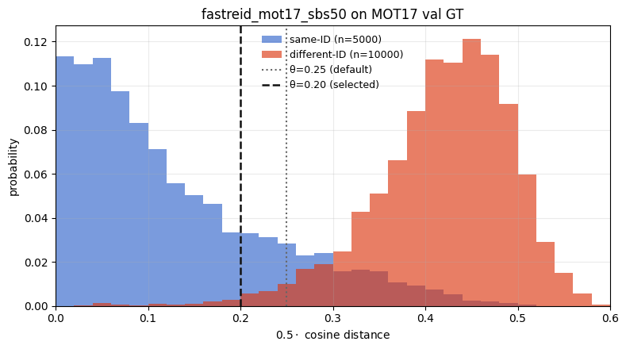
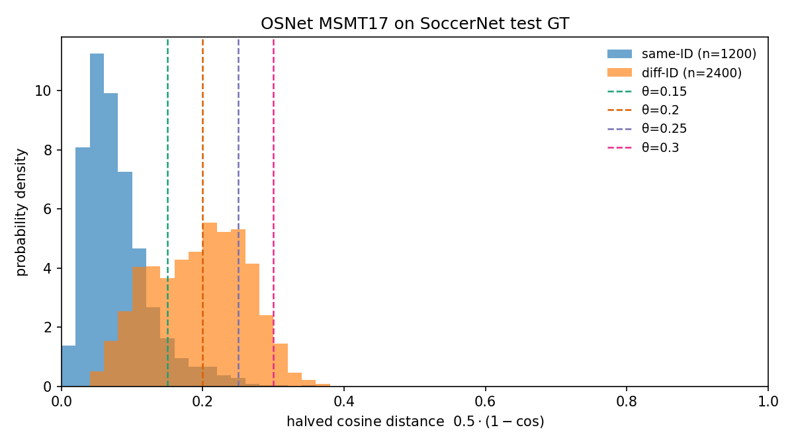

# ReID API

Requires the optional extra:

```bash
pip install 'trackers[reid]'
```

This page covers the `ReIDEncoder` protocol, `FeatureBank`, and appearance
association helpers in `trackers.core.reid`. Model loading and gallery
evaluation are in the standalone [`reid`](https://github.com/roboflow/re-ID)
package. BoT-SORT usage is on the [BoT-SORT](../trackers/botsort.md) page.

## BoT-SORT with and without ReID

### MOT17 test

YOLOX detections, CMC on, Codabench MOT17 test (same protocol as the
[tracker comparison](../trackers/comparison.md) default table). ReID:
`fastreid_mot17_sbs50`, `appearance_threshold=0.2`
([MOT17 re-ID study](https://www-sop.inria.fr/members/Francois.Bremond/Postscript/Tomasz__SCCAI_2025.pdf)
Table 8).

| Config          |  HOTA  |  IDF1  |  MOTA  |
| :-------------- | :----: | :----: | :----: |
| BoT-SORT        |  63.7  |  78.7  | **79.2** |
| BoT-SORT + ReID | **63.9** | **79.2** | **79.2** |

### MOT17 val-half

[`eval_trackers_reid.ipynb`](../../notebooks/eval_trackers_reid.ipynb), YOLOX
detections, CMC on, same encoder and threshold.

| Config          |  HOTA  |  MOTA  |  IDF1  |
| :-------------- | :----: | :----: | :----: |
| BoT-SORT        |  68.9  |  78.3  |  81.2  |
| BoT-SORT + ReID | **69.1** | **78.4** | **81.9** |

### SoccerNet test (OSNet MSMT17)

Oracle detections, CMC on, SoccerNet-tracking test (same protocol as the
[tracker comparison](../trackers/comparison.md) default table). ReID:
`osnet_x1_0_msmt17_combineall` (MSMT17 pretrained), `appearance_threshold=0.2`.

| Config                        |  HOTA  |  IDF1  |  MOTA  |
| :---------------------------- | :----: | :----: | :----: |
| BoT-SORT                      |  84.5  |  79.3  | **96.6** |
| BoT-SORT + OSNet MSMT17 (OOD) | **84.6** | **79.4** | **96.6** |

## Choosing an appearance threshold

BoT-SORT rejects an appearance match when
`d_app = 0.5 * (1 - cos_sim)` exceeds `appearance_threshold` (paper default
0.25). Pick θ on a labeled split with the encoder you will track with:

1. Embed GT crops.
2. Histogram `d_app` for same-ID vs different-ID pairs.
3. Choose θ so most same-ID pairs fall below it and most different-ID pairs
   fall above it.

**MOT17 val, `fastreid_mot17_sbs50`.** Same-ID peaks near 0, different-ID near
0.4. θ=0.2 keeps ~88% of same-ID pairs and ~1% of different-ID pairs
(study Table 8; stricter than the paper default 0.25).



**SoccerNet test, `osnet_x1_0_msmt17_combineall`.** Same-ID and different-ID
overlap heavily (similar kits). θ=0.2 passes ~50% of different-ID pairs, so
appearance adds little on this domain (see table above).



## Use with BoT-SORT

```python
from reid import ReIDModel

from trackers import BoTSORTTracker

reid_model = ReIDModel.from_pretrained("fastreid_mot17_sbs50")
tracker = BoTSORTTracker(reid_model=reid_model, appearance_threshold=0.2)
```

| Parameter              | Default | Purpose                                                                                          |
| ---------------------- | ------- | ------------------------------------------------------------------------------------------------ |
| `reid_ema_alpha`       | 0.9     | EMA momentum for a track's appearance feature.                                                   |
| `appearance_threshold` | 0.25    | Max `d_app` for an appearance match (BoT-SORT paper default; MOT17 setup above uses 0.2).      |
| `proximity_threshold`  | 0.5     | IoU gate before appearance (`IoU ≥ 1 - proximity_threshold`), from true IoU even with GIoU/DIoU/CIoU. |

Model catalog and fine-tuning:
[`reid` training guide](https://github.com/roboflow/re-ID/blob/main/docs/learn/train.md).

## Encoder protocol

::: trackers.core.reid.encoder.ReIDEncoder

## Feature bank

Per-track EMA of appearance embeddings, L2-normalized before and after the
blend ([BoT-SORT `STrack.update_features`](https://github.com/NirAharon/BoT-SORT/blob/main/tracker/bot_sort.py)).

::: trackers.core.reid.feature_bank.FeatureBank

## Appearance

::: trackers.core.reid.appearance.appearance_similarity

::: trackers.core.reid.appearance.extract_detection_embeddings
