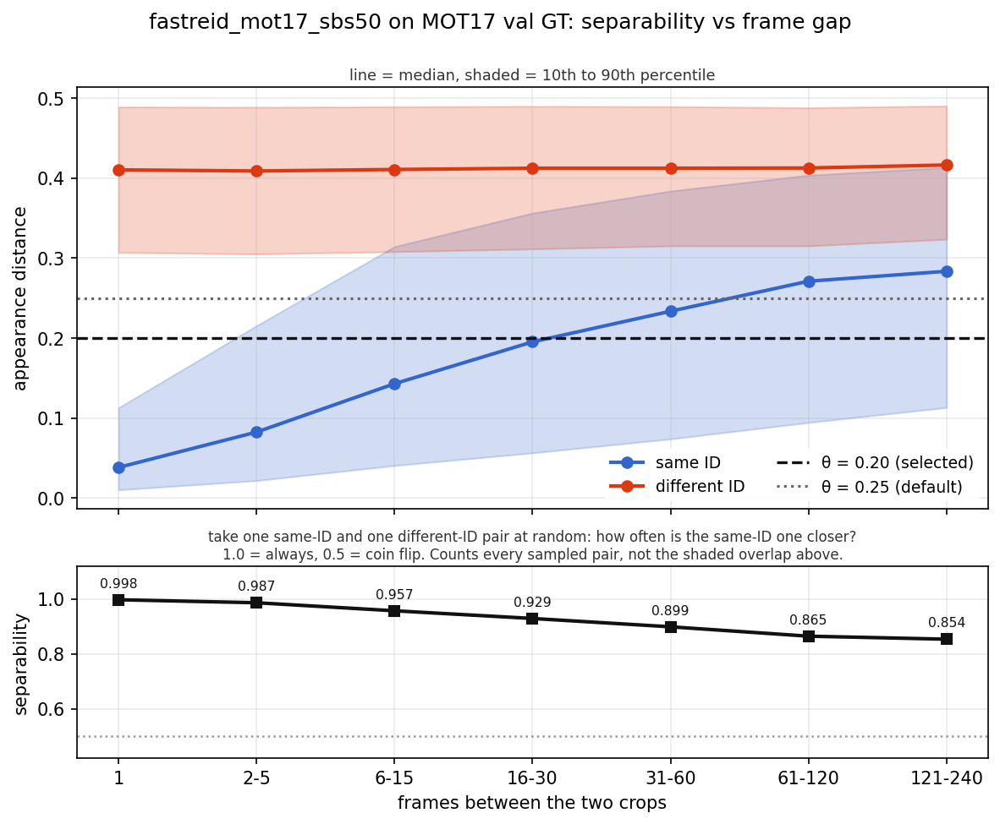
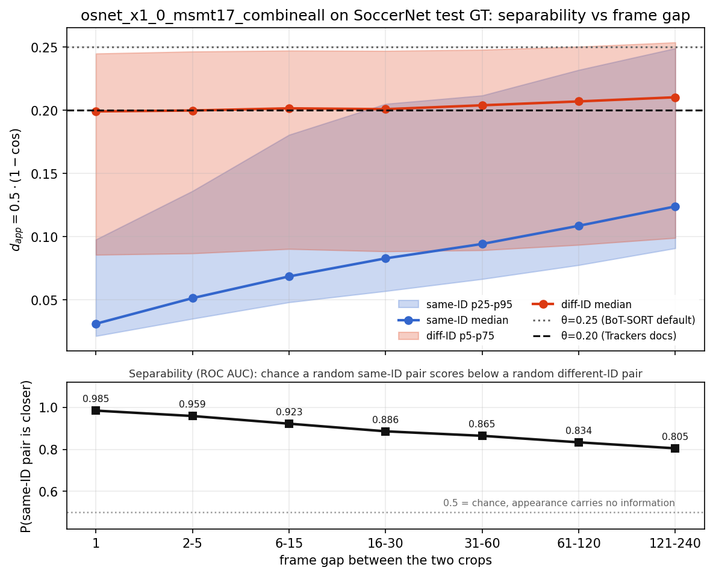

# ReID Appearance

BoT-SORT can fuse appearance embeddings with IoU during association. Embeddings come from a model in the standalone [`reid`](https://github.com/roboflow/re-ID) package. See the [ReID API](../api/reid.md) for the association helpers.

**What you'll learn:**

- How to enable appearance association on BoT-SORT
- Which parameters control the appearance gate
- How to pick `reid_appearance_threshold` for your encoder and domain
- What ReID changes on MOT17 and SoccerNet

---

## Install

```bash
pip install "trackers[reid]"
```

For extra contents and other options, see the [install guide](install.md).

---

## Quickstart

```python
from reid import ReIDModel

from trackers import BoTSORTTracker

reid_model = ReIDModel.from_pretrained("fastreid_mot17_sbs50")
tracker = BoTSORTTracker(reid_model=reid_model, reid_appearance_threshold=0.2)
```

!!! warning "A frame is required when ReID is enabled"

    Pass the current video frame as `tracker.update(detections, frame=frame_bgr)`. When `reid_model` is set, `update()` raises if `frame` is omitted.

For the model catalog and fine-tuning, see the [`reid` training guide](https://github.com/roboflow/re-ID/blob/main/docs/learn/train.md).

---

## Key Parameters

|          Parameter          |                                                                        Purpose                                                                        |                                                                                                                                  Tuning guidance                                                                                                                                  |
| :-------------------------: | :---------------------------------------------------------------------------------------------------------------------------------------------------: | :-------------------------------------------------------------------------------------------------------------------------------------------------------------------------------------------------------------------------------------------------------------------------------: |
|        `reid_model`         |                                                    Appearance encoder queried during association.                                                     |                                                                                         Leave unset for IoU and CMC only. Pick a checkpoint trained on your object domain where possible.                                                                                         |
|      `reid_ema_alpha`       |                                                    EMA momentum for a track's appearance feature.                                                     |                                                                                 Default 0.9. Higher keeps a stable long-term identity; lower adapts faster to appearance change but drifts more.                                                                                  |
| `reid_appearance_threshold` |                                  Maximum appearance distance `d_app` for appearance to lower a pair's matching cost.                                  |                                                                                                     BoT-SORT paper default 0.25. Calibrate per encoder and domain, see below.                                                                                                     |
| `reid_proximity_threshold`  |                  IoU gate applied before appearance (`IoU ≥ 1 - reid_proximity_threshold`), from true IoU even with GIoU/DIoU/CIoU.                   |                                                                                 Default 0.5. Raise to 1.0 where targets leave the frame and return, see [below](#choosing-a-proximity-threshold).                                                                                 |
|        `reid_fusion`        |         How appearance combines with geometry: `"botsort"` takes the minimum of the two costs, `"adaptive"` adds a weighted appearance term.          |                                                                                         Default `"botsort"`. See [choosing a fusion method](#choosing-a-fusion-method) before switching.                                                                                          |
|  `reid_appearance_weight`   |                                       Base appearance weight when `reid_fusion="adaptive"`. Ignored otherwise.                                        |                                                                                                           Default 0.75. Raise where geometry is unreliable, see below.                                                                                                            |
| `reid_adaptive_weight_cap`  |                                    Ceiling on the adaptive bonus when `reid_fusion="adaptive"`. Ignored otherwise.                                    |                                                                                                            Default 0.5. Raise together with `reid_appearance_weight`.                                                                                                             |
|   `reid_appearance_floor`   | Minimum cosine similarity for appearance to contribute when `reid_fusion="adaptive"`; below it a pair is scored on geometry alone. Ignored otherwise. | Default 0.0 (off, the Deep OC-SORT behaviour). Calibrate per encoder: 0.7 with `reid_proximity_threshold=1.0` is the value for `osnet_x1_0` fine-tuned on SoccerNet and loses HOTA with the MOT17 and MSMT17 encoders, see [choosing a fusion method](#choosing-a-fusion-method). |

---

## Choosing an appearance threshold

BoT-SORT fuses costs as `min(d_iou, d_app)` with `d_app = 0.5 * (1 - cos_sim)`, and discards the appearance term when `d_app` exceeds `reid_appearance_threshold` (paper default 0.25) or when the pair fails the `reid_proximity_threshold` IoU gate. Appearance can therefore only lower a pair's cost, never veto a geometric match. Pick θ on a labeled split with the encoder you will track with:

1. Embed GT crops.
2. Histogram `d_app` for association-local pairs: same video only, with frame gap bounded by the lost-track horizon (default 30 frames). Positives are same-ID; negatives are different-ID that could co-compete. Sample both classes with the same per-sequence quota, otherwise one crowded sequence decides the answer.
3. Choose θ so most same-ID pairs fall below it and most different-ID pairs fall above it.

All three steps ship with Trackers, so you can run them on your own footage. `extract_ground_truth_embeddings` reads any MOT-format dataset, meaning a `gt/gt.txt` and an `img1` folder per sequence, and returns each crop's embedding alongside the identity, frame and sequence it came from:

```python
from trackers.core.reid import (
    extract_ground_truth_embeddings,
    plot_appearance_distances,
    sample_appearance_distances,
)

embeddings, ids, frame_ids, sequence_ids = extract_ground_truth_embeddings(model, "mot17/val", keep_classes=(1,))
distances = sample_appearance_distances(embeddings, ids, frame_ids, sequence_ids)
for threshold in (0.10, 0.20, 0.25):
    same_id_rate, different_id_rate = distances.rates_at(threshold)
    print(f"θ={threshold:.2f}: same-ID {same_id_rate:.1%}, different-ID {different_id_rate:.1%}")

plot_appearance_distances(distances, thresholds={0.20: "selected", 0.25: "default"})
```

See the [ReID API reference](../api/reid.md#choosing-a-threshold) for the full signatures. The figures on this page were produced with these helpers on MOT17 val and SoccerNet test ground truth. To reproduce them end to end, from download to calibrated threshold, open the [ReID cookbook](https://colab.research.google.com/github/roboflow/trackers/blob/develop/docs/cookbooks/how-to-add-reid-to-trackers.ipynb) in Colab.

**MOT17 val, `fastreid_mot17_sbs50`.** Same-ID distances peak near 0 and different-ID near 0.4. On association-local GT crop pairs (5000 same-ID, 10000 different-ID, frame gap 1 to 30), θ=0.2 keeps 68% of same-ID pairs while passing 1.1% of different-ID pairs. Raising θ to the BoT-SORT default 0.25 recovers same-ID pairs (79%) but nearly triples the different-ID pairs it admits (2.9%), which is why 0.2 is the better operating point here ([MOT17 re-ID study](https://www-sop.inria.fr/members/Francois.Bremond/Postscript/Tomasz__SCCAI_2025.pdf) Table 8 uses the same threshold).


**SoccerNet test, `osnet_x1_0_msmt17_combineall`.** A pedestrian encoder on soccer footage squeezes every distance into a narrow range: same-ID pairs peak near 0.05 and different-ID pairs near 0.20 (similar kits). The two shapes still separate, but the scale no longer matches the thresholds BoT-SORT was tuned with. On association-local GT crop pairs (5000 same-ID, 10000 different-ID, frame gap 1 to 30), θ=0.2 admits 96% of same-ID pairs but also 49% of different-ID pairs, and θ=0.1 holds different-ID pairs to 9%. Neither rescues tracking under the default `botsort` rule: every threshold from 0.1 up costs about 1.6 HOTA against CMC-only (see the SoccerNet table below), because with oracle boxes the pairs the gate removes are not the ones deciding an assignment under the minimum fusion. What does rescue it is the fusion rule and the gate: `adaptive` at `reid_proximity_threshold=0.99` turns the same encoder into a gain of about 1.1 HOTA, and the fine-tuned encoder adds on top of that.


---

## How far the threshold carries

A histogram fixes one frame gap, so it only describes re-association over that horizon. Sweeping the gap shows how long a track can stay lost before appearance stops helping to re-find it. `sweep_frame_gap` repeats the sampling above across widening bands, and `plot_frame_gap_sweep` draws the result:

```python
from trackers.core.reid import plot_frame_gap_sweep, sweep_frame_gap

sweep = sweep_frame_gap(embeddings, ids, frame_ids, sequence_ids)
plot_frame_gap_sweep(sweep, thresholds={0.20: "selected", 0.25: "default"})
```

On MOT17 val, different-ID distances barely move with the gap: the median stays near 0.41 and the 10th percentile near 0.31 from a 1-frame gap out to 240 frames. Same-ID distances spread steadily, from a median of 0.04 at a 1-frame gap to 0.20 across the 16 to 30 band and 0.28 beyond 120 frames.

ROC AUC below is the chance that a random same-ID pair scores closer than a random different-ID pair: 1.0 means the two never cross, 0.5 means appearance carries no information, and its complement is how often a same-ID pair sits farther apart than a different-ID one. It is the area under the curve traced by sweeping θ from 0 to 1 and plotting the two rates next to it, so it summarises every threshold instead of the single one we ship.

It is not the area where the shaded bands cross in the figure. That is two percentile ranges intersecting, which ignores where the mass sits and which side is closer; at a 1-frame gap the bands never touch yet the AUC is 0.998 rather than 1.0. The two rates beside it evaluate the default 0.25 and the 0.2 this page argues for, rather than deriving a third.

| Frame gap  | ROC AUC | same-ID below 0.2 | different-ID below 0.2 |
| :--------- | :-----: | :---------------: | :--------------------: |
| 1          |  0.998  |       98.0%       |          1.7%          |
| 2 to 5     |  0.987  |       87.6%       |          1.6%          |
| 6 to 15    |  0.957  |       67.4%       |          1.1%          |
| 16 to 30   |  0.929  |       51.4%       |          1.1%          |
| 31 to 60   |  0.899  |       39.8%       |          0.9%          |
| 61 to 120  |  0.865  |       31.8%       |          0.8%          |
| 121 to 240 |  0.854  |       28.7%       |          0.8%          |



Two things follow. First, a threshold validated on adjacent frames says little about re-association: at θ=0.2 appearance helps 98% of same-ID pairs one frame apart but only 51% across the default 30-frame lost-track buffer. Second, the price of a tight θ over long gaps is missed re-associations rather than extra wrong ones, because the different-ID rate stays near 1% throughout. If you raise `lost_track_buffer` to recover tracks after long occlusions, raise `reid_appearance_threshold` with it and re-check the different-ID column.

The cross-domain encoder fails differently. On SoccerNet the different-ID rate at θ=0.2 stays between 44% and 51% at every gap, so the frame gap is not what limits it; the encoder simply cannot separate players in matching kits at any horizon. Widening the gap costs same-ID pairs (99.6% down to 87.0%) without ever making the different-ID side usable, so no threshold makes the generic encoder useful here under the minimum fusion; the additive rule with an open gate is what does, see the SoccerNet table under Other encoders. The SoccerNet rows in the tables above go further with an encoder fine-tuned on the dataset's own train split.



---

## Choosing a proximity threshold

`reid_proximity_threshold` decides which track-detection pairs appearance is allowed to score. A pair is dropped before appearance is consulted whenever `1 - IoU` exceeds the threshold, so the 0.5 default limits appearance to pairs that already overlap at `IoU >= 0.5`, and 0.99 still requires `IoU >= 0.01`. Only 1.0 disables the gate.

**Why it matters.** Lost tracks are represented by their Kalman prediction. After an occlusion the prediction has drifted and overlaps the re-emerging detection weakly; after a target leaves the frame the prediction has been extrapolated out of it and the overlap with the returning detection is exactly zero. The default excludes both cases, 0.99 admits the first, and only 1.0 admits the second. The reference Deep OC-SORT tracker recovers the second case with a geometry-only pass against the last observed box (OCR); BoT-SORT has no such stage, so appearance at an open gate is the only route.

On SoccerNet test (oracle detections, `osnet_x1_0` fine-tuned on SoccerNet train, library-default geometry):

| `reid_proximity_threshold` | appearance consulted when | HOTA  | ID switches |
| :------------------------- | :------------------------ | :---: | :---------: |
| none (no ReID)             |                           | 84.56 |    2939     |
| 0.5 (default)              | `IoU >= 0.50`             | 84.52 |    3012     |
| 0.8                        | `IoU >= 0.20`             | 85.02 |    3268     |
| 0.95                       | `IoU >= 0.05`             | 85.69 |    2565     |
| 0.99                       | `IoU >= 0.01`             | 85.82 |    2431     |

On the [published tuned BoT-SORT geometry](../evaluations/results.md#soccernet-tracking) for SoccerNet, `adaptive` at 0.99 scores 85.87 HOTA with 2433 switches and at 1.0 scores 86.23 with **1692**, against 85.00 and 2523 without appearance. Adding `reid_appearance_floor=0.7` at 1.0 reaches **87.82** with 2111 switches, the best SoccerNet configuration measured. The identity gain is almost entirely the last step: 1.0 is what lets a player who walked out of frame come back with the same id. `botsort` at 1.0 reaches 87.29 HOTA but 4564 switches, see [choosing a fusion method](#choosing-a-fusion-method).

Half-opening is the worst setting for identity: 0.8 has more ID switches than either the closed gate or no appearance at all, because it admits enough distant candidates to create false matches without admitting the ones that enable recoveries. Either keep the gate or disable it.

The right value depends on the footage. DanceTrack val targets stay in frame, and there opening the gate only adds false matches: `adaptive` at its best weights falls from 57.39 HOTA at 0.5 to 56.56 at 1.0, and `botsort` falls from 56.11 to 46.20 with seven times the ID switches, because `min(d_iou, d_app)` with no geometric check flips between dancers that look alike every frame. Use 1.0 where identity is lost to camera motion or targets leaving the frame, and prefer `adaptive` there; keep 0.5 where targets stay in view.

## Choosing a fusion method

`reid_fusion` selects how the appearance score reaches the cost matrix.

`"botsort"` (default) takes `min(d_iou, d_app)`. Appearance competes with geometry and wins only when it is strictly cheaper, so a pair is accepted when either cue is confident. Both gates are hard: a pair either clears `reid_appearance_threshold` and `reid_proximity_threshold` or contributes nothing.

`"adaptive"` adds a weighted appearance term to the geometric similarity, with the weight growing when the best appearance match stands clear of the runner-up and falling back to `reid_appearance_weight` when the top candidates are hard to tell apart. This is the weighting from Deep OC-SORT, ported on its own onto BoT-SORT; the velocity term, the confidence-gated feature update and the OCR pass are not included. `reid_appearance_threshold` has no effect under this method. `reid_appearance_floor`, an addition of this library, sets a minimum cosine similarity below which a pair falls back to geometry alone: with the gate open it stops lost tracks from capturing unrelated detections on weak appearance matches, which otherwise clear the association threshold whenever geometry contributes nothing.

Two consequences are worth knowing before switching:

- **The similarity range changes.** `"botsort"` returns values in `[0, 1]`; `"adaptive"` returns `[0, 1 + reid_appearance_weight + reid_adaptive_weight_cap]`, which is `[0, 2.25]` at the defaults. `minimum_iou_threshold_first_assoc` is applied to that fused value, so a threshold tuned for one method is a different gate under the other. Retune it when you switch, or the comparison measures the gate rather than the fusion.
- **The weights are domain-dependent.** Deep OC-SORT reports `reid_appearance_weight=0.75` with `reid_adaptive_weight_cap=0.5` for MOT17 and MOT20, and `1.25` with `1.0` for DanceTrack, where dancers occlude constantly and geometry carries less. The defaults here follow the MOT17/MOT20 pair.

### Measured comparison

HOTA, best configuration found for each method. Detections, CMC, encoder and geometry are shared within a row; only appearance handling differs. SoccerNet and MOT17 use the published tuned BoT-SORT geometry from the [tracker comparison](../evaluations/results.md): `lost_track_buffer=60`, `minimum_iou_threshold_first_assoc=0.1`, `minimum_iou_threshold_second_assoc=0.6`, `minimum_iou_threshold_unconfirmed_assoc=0.2` for SoccerNet, and `track_activation_threshold=0.6`, `high_conf_det_threshold=0.5`, `minimum_iou_threshold_unconfirmed_assoc=0.2` for MOT17. DanceTrack's tuned set coincides with the library defaults. All other parameters are library defaults.

|    Dataset     |              Encoder              |  no ReID  | `botsort` | `adaptive` |                       `botsort` parameters                        |                                                   `adaptive` parameters                                                    |
| :------------: | :-------------------------------: | :-------: | :-------: | :--------: | :---------------------------------------------------------------: | :------------------------------------------------------------------------------------------------------------------------: |
| SoccerNet test | `osnet_x1_0` fine-tuned SoccerNet |   85.00   |   87.29   | **87.82**  | `reid_appearance_threshold=0.075`, `reid_proximity_threshold=1.0` | `reid_appearance_weight=0.75`, `reid_adaptive_weight_cap=0.5`, `reid_proximity_threshold=1.0`, `reid_appearance_floor=0.7` |
| DanceTrack val |  `osnet_x1_0_msmt17_combineall`   |   53.89   |   56.11   | **57.39**  | `reid_appearance_threshold=0.25`, `reid_proximity_threshold=0.5`  |                 `reid_appearance_weight=2.4`, `reid_adaptive_weight_cap=0`, `reid_proximity_threshold=0.5`                 |
| MOT17 val-half |   `osnet_x1_0` fine-tuned MOT17   | **69.05** |   69.00   |   68.72    | `reid_appearance_threshold=0.25`, `reid_proximity_threshold=0.5`  |               `reid_appearance_weight=0.75`, `reid_adaptive_weight_cap=0.5`, `reid_proximity_threshold=0.5`                |

HOTA. Each cell is the best configuration found for that method (on SoccerNet the threshold and weight come from closed-gate sweeps with only the gate changed to 1.0, so they are good settings rather than necessarily the best); the parameter columns give the full ReID settings it ran with, defaults included. MOT17 moves by less than 0.35 HOTA in any direction on 7 sequences, inside single-sequence variance.

**The two rules trade HOTA against identity stability.** On DanceTrack `adaptive` leads on both, cutting ID switches from 1905 to 1683 where `botsort` raises them to 2276 while still gaining HOTA. On SoccerNet with the gate disabled `botsort` beats floor-less `adaptive` on HOTA and IDF1 (87.29 and 83.13 against 86.23 and 82.52) but takes 4564 ID switches against 1692, 81% more than running no appearance at all; two thirds of its identity changes revert within ten frames, because `min(d_iou, d_app)` takes whichever candidate is cheapest in the current frame and flips between players in the same kit. `adaptive` commits to a re-association and keeps it, so its errors are fewer and longer. With `reid_appearance_floor=0.7` blocking the weakest captures, `adaptive` leads SoccerNet outright: 87.82 HOTA and 83.92 IDF1 with 2111 switches (SoccerNet test, tuned geometry, fine-tuned encoder). That floor value belongs to that encoder: applied unchanged at the open gate it loses HOTA on MOT17 val-half (66.44 against 68.96 without appearance), DanceTrack val (52.98 against 56.56 without the floor) and SportsMOT val (81.00 against 81.32), all with generic or differently fine-tuned `osnet_x1_0` encoders whose cosine scales differ. Treat the floor as a per-encoder calibration, like `reid_appearance_threshold`, and leave it at 0.0 until you have measured it. Prefer `adaptive` when stable ids matter, which is the usual reason to enable appearance. The adaptive bonus itself contributes little: with `reid_adaptive_weight_cap=0` HOTA changes by 0.12 on SoccerNet and 0.13 on DanceTrack. Leave the cap at its default and tune `reid_appearance_weight` and `reid_proximity_threshold` instead.

### Choosing the adaptive weight

Deep OC-SORT reports `reid_appearance_weight=0.75` for MOT17 and MOT20 and `1.25` for DanceTrack. On SoccerNet test and MOT17 val-half a sweep from 0.75 to 2.5 moves HOTA by less than 0.15, so the default transfers. DanceTrack val needs more than the reported value:

| `reid_appearance_weight` |   HOTA    | ID switches |
| :----------------------: | :-------: | :---------: |
|     1.25 (reported)      |   55.97   |    1736     |
|           1.6            |   57.23   |    1696     |
|           2.4            | **57.26** |  **1686**   |

The step sits between 1.25 and 1.6 and everything above it is a plateau. Where appearance barely separates identities the adaptive bonus collapses and only the base weight does any work, which is DanceTrack's situation and why the weight matters there.

`"botsort"` remains the default because it is the more conservative of the two: bounded output, a hard appearance gate, and no threshold changes when you enable it.

## BoT-SORT with and without ReID

<!-- BENCH-XREF copy-of: [docs/evaluations/results.md](../evaluations/results.md) BoT-SORT + ReID row in the mot17/sportsmot/soccernet/dancetrack Tuned tables (HOTA / IDF1 / MOTA of the best row per dataset). The encoder, parameter and IDSW columns exist only here; DanceTrack's adaptive row is pending a run with the fine-tuned encoder. Update results.md first, then mirror here. -->

Evaluations are on test splits and one table per fusion method. Each ReID row shares its detections and geometry with the BoT-SORT row above it, so only the appearance branch differs, and both come from the [tracker comparison](../evaluations/results.md), where the full configuration for each is listed. Detection sources and split usage are covered in [Methodology](../evaluations/methodology.md). Bold marks the best cell per dataset across both tables.

The encoder is part of the configuration. SoccerNet, MOT17 and DanceTrack use an `osnet_x1_0` fine-tuned on the dataset's own train split, SportsMOT the generic `osnet_x1_0_msmt17_combineall`, so absolute numbers do not compare across datasets and only the with and without deltas do. Within a dataset both fusion rules run the same encoder, which is what makes the two tables comparable; DanceTrack's `adaptive` row is pending a run with the fine-tuned encoder. With the generic encoder DanceTrack loses to plain BoT-SORT under both rules, see [Other encoders](#other-encoders).

### `reid_fusion="botsort"`

`min(d_iou, d_app)`, gated by `reid_appearance_threshold` and `reid_proximity_threshold`.

| Dataset         | Config          |   HOTA    |   IDF1    |   MOTA   | IDSW | Encoder                            | ReID parameters                                                   |
| :-------------- | :-------------- | :-------: | :-------: | :------: | :--: | :--------------------------------- | :---------------------------------------------------------------- |
| SoccerNet test  | BoT-SORT        |   85.00   |   79.68   |  97.25   | 2523 | —                                  | —                                                                 |
| SoccerNet test  | BoT-SORT + ReID |   87.29   |   83.13   |  98.73   | 4564 | `osnet_x1_0` fine-tuned SoccerNet  | `reid_appearance_threshold=0.075`, `reid_proximity_threshold=1.0` |
| MOT17 test      | BoT-SORT        |   63.8    |   78.7    |   79.4   |  —   | —                                  | —                                                                 |
| MOT17 test      | BoT-SORT + ReID | **64.12** | **79.16** |  79.36   | 1617 | `osnet_x1_0` fine-tuned MOT17      | `reid_appearance_threshold=0.25`, `reid_proximity_threshold=0.5`  |
| SportsMOT test  | BoT-SORT        |   73.8    |   73.4    |   96.9   |  —   | —                                  | —                                                                 |
| SportsMOT test  | BoT-SORT + ReID |   73.48   |   73.10   |  96.88   | 2863 | `osnet_x1_0_msmt17_combineall`     | `reid_appearance_threshold=0.15`, `reid_proximity_threshold=0.5`  |
| DanceTrack test | BoT-SORT        |   57.8    |   57.9    | **92.2** |  —   | —                                  | —                                                                 |
| DanceTrack test | BoT-SORT + ReID | **58.5**  | **58.9**  |   92.1   |  —   | `osnet_x1_0` fine-tuned DanceTrack | `reid_appearance_threshold=0.25`, `reid_proximity_threshold=0.5`  |

### `reid_fusion="adaptive"`

`IoU + w·cos` with the Deep OC-SORT bonus, gated by `reid_proximity_threshold` and, where set, `reid_appearance_floor`.

| Dataset         | Config          |   HOTA    |   IDF1    |   MOTA    |   IDSW   | Encoder                            | ReID parameters                                                                                                            |
| :-------------- | :-------------- | :-------: | :-------: | :-------: | :------: | :--------------------------------- | :------------------------------------------------------------------------------------------------------------------------- |
| SoccerNet test  | BoT-SORT        |   85.00   |   79.68   |   97.25   |   2523   | —                                  | —                                                                                                                          |
| SoccerNet test  | BoT-SORT + ReID | **87.82** | **83.92** | **99.43** |   2111   | `osnet_x1_0` fine-tuned SoccerNet  | `reid_appearance_weight=0.75`, `reid_adaptive_weight_cap=0.5`, `reid_proximity_threshold=1.0`, `reid_appearance_floor=0.7` |
| MOT17 test      | BoT-SORT        |   63.8    |   78.7    |   79.4    |    —     | —                                  | —                                                                                                                          |
| MOT17 test      | BoT-SORT + ReID |   63.8    |   78.86   | **79.49** | **1416** | `osnet_x1_0` fine-tuned MOT17      | `reid_appearance_weight=0.75`, `reid_adaptive_weight_cap=0.5`, `reid_proximity_threshold=0.5`                              |
| SportsMOT test  | BoT-SORT        |   73.8    |   73.4    |   96.9    |    —     | —                                  | —                                                                                                                          |
| SportsMOT test  | BoT-SORT + ReID | **74.98** | **75.09** | **96.99** | **2306** | `osnet_x1_0_msmt17_combineall`     | `reid_appearance_weight=0.75`, `reid_adaptive_weight_cap=0.5`, `reid_proximity_threshold=0.99`                             |
| DanceTrack test | BoT-SORT        |   57.8    |   57.9    | **92.2**  |    —     | —                                  | —                                                                                                                          |
| DanceTrack test | BoT-SORT + ReID |     —     |     —     |     —     |    —     | `osnet_x1_0` fine-tuned DanceTrack | not yet run with this encoder                                                                                              |

Anything not listed in the ReID parameters column is a library default, and the DanceTrack leaderboard does not return ID switches. Each rule is shown at its own best gate. On SportsMOT both were swept across 0.5, 0.99 and 1.0 on the val split: `botsort` is strongest at the default 0.5 (79.38 HOTA), scoring 77.82 at 0.99 and 64.80 at 1.0, while `adaptive` peaks at 0.99. The wider gate suits the additive rule and not the minimum, which is consistent with how the two combine appearance, so the comparison holds with both rules given the same range. On SoccerNet both rules were run at 1.0, and on DanceTrack with the generic encoder (see Other encoders). On SoccerNet neither was re-tuned there, so both carry thresholds chosen at the closed gate. On MOT17 only `adaptive` has been run past the default gate, where it scores below its closed-gate result.

### Other encoders

The rows above use the best encoder found for each dataset. These measurements used other encoders and are kept because they show how much that choice decides.

#### MOT17, `fastreid_mot17_sbs50`

The MOT17-trained FastReID checkpoint BoT-SORT itself uses, run on library-default geometry at `reid_appearance_threshold=0.2` ([MOT17 re-ID study](https://www-sop.inria.fr/members/Francois.Bremond/Postscript/Tomasz__SCCAI_2025.pdf) Table 8).

Codabench MOT17 test:

| Config          |   HOTA   |   IDF1   |   MOTA   |
| :-------------- | :------: | :------: | :------: |
| BoT-SORT        |   63.7   |   78.7   | **79.2** |
| BoT-SORT + ReID | **63.9** | **79.2** | **79.2** |

MOT17 val-half, scored with `trackers eval`:

| Config          |   HOTA   |   IDF1   |   MOTA   |
| :-------------- | :------: | :------: | :------: |
| BoT-SORT        |   68.9   |   81.2   |   78.3   |
| BoT-SORT + ReID | **69.1** | **81.9** | **78.4** |

The MOT17 re-ID study reports 68.43 HOTA / 80.92 IDF1 without ReID and 68.95 / 81.98 with, on the same split at `reid_appearance_threshold=0.2` (Table 8 and Table 13; MOTA is not reported for that YOLOX setup).

#### DanceTrack, `osnet_x1_0_msmt17_combineall`

The generic pedestrian encoder on dancers, run on library-default geometry, YOLOX detections, Codabench DanceTrack test. Both rules land below geometry alone; the fine-tuned encoder in the tables above is what turns DanceTrack around.

| Config                                               |   HOTA   |   IDF1   |   MOTA   |
| :--------------------------------------------------- | :------: | :------: | :------: |
| BoT-SORT                                             | **57.8** | **57.9** |   92.2   |
| BoT-SORT + ReID, `botsort` (θ=0.25, gate=0.5)        |   56.0   |   56.1   |   91.8   |
| BoT-SORT + ReID, `adaptive` (w=2.4, cap=0, gate=0.5) |   57.2   |   56.5   | **92.3** |

#### SoccerNet, `osnet_x1_0_msmt17_combineall`

A generic pedestrian encoder on soccer footage, run on library-default geometry with `reid_fusion="botsort"`, gate 0.5, oracle detections, SoccerNet-tracking test. Under the default `botsort` rule the appearance threshold makes no practical difference: every value from 0.1 up gives the same result, and all of them sit below geometry alone, while opening the gate to 1.0 under that rule collapses to 65.9 HOTA with over 24,000 ID switches, as it does on SportsMOT and DanceTrack. Switching to `adaptive` fusion with the gate at 0.99 turns the same encoder into a gain; at its own default gate the adaptive rule is merely neutral. The fine-tuned rows above go further still.

| Config                                         |   HOTA   |   IDF1   |   MOTA   |
| :--------------------------------------------- | :------: | :------: | :------: |
| BoT-SORT                                       |   84.5   |   79.3   |   96.6   |
| BoT-SORT + OSNet MSMT17 (θ=0.1)                |   82.9   |   77.7   |   96.5   |
| BoT-SORT + OSNet MSMT17 (θ=0.25, default)      |   82.9   |   77.7   |   96.5   |
| BoT-SORT + OSNet MSMT17, `adaptive`, defaults  |   84.5   |   79.2   |   96.5   |
| BoT-SORT + OSNet MSMT17, `adaptive`, gate 0.99 | **85.7** | **80.1** | **98.1** |
