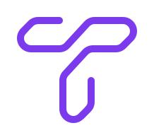

<div align="center">



</div>

<!-- BENCH-XREF copy-of: [docs/evaluations/results.md](evaluations/results.md) mot17-default table, McByte HOTA cell. Update results.md first, then mirror here. -->

Roboflow Trackers achieves 64.1 HOTA on MOT17 with McByte, benchmarked across four standard datasets, with ByteTrack and OC-SORT as zero-extra-dependency defaults. Apache 2.0, Python 3.10+.

Current release: v2.6.0 — see the [changelog](changelog.md) for release history.

<video width="100%" style="aspect-ratio: 16/9;" controls muted loop preload="none" poster="assets/track-objects-page-poster.webp" aria-label="Trackers object tracking demo">
  <source src="https://storage.googleapis.com/com-roboflow-marketing/trackers/docs/track-objects-page.mp4" type="video/mp4">
  <track src="assets/track-objects-page.vtt" kind="captions" srclang="en" label="English" default>
</video>

---

## Install

Get started by installing the package.

```bash
pip install trackers
```

For more options, see the [install guide](guides/install.md).

---

<a href="https://www.youtube.com/watch?v=u0k2dTZ0vfs"></a>

---

## Track from CLI

Point at a video, webcam, RTSP stream, or image directory. Get tracked output.

```bash
trackers track \
    --source video.mp4 \
    --output.video output.mp4 \
    --detection.model rfdetr-medium \
    --tracker bytetrack \
    --show.labels \
    --show.trajectories
```

For all CLI options, see the [tracking guide](guides/track.md).

---

## Track from Python

Plug trackers into your existing detection pipeline. Works with any detector.

This example uses the `inference` package for detection — install it separately with `pip install inference` (it is not part of the base `trackers` install or any of its extras).

```python hl_lines="4 7 17"
import cv2
import supervision as sv
from inference import get_model
from trackers import ByteTrackTracker

model = get_model(model_id="rfdetr-medium")
tracker = ByteTrackTracker()

cap = cv2.VideoCapture("video.mp4")
while cap.isOpened():
    ret, frame = cap.read()
    if not ret:
        break

    result = model.infer(frame)[0]
    detections = sv.Detections.from_inference(result)
    tracked = tracker.update(detections)
```

For more examples, see the [tracking guide](guides/track.md).

---

## Evaluate

Benchmark your tracker against ground truth with standard MOT metrics.

```bash
trackers eval \
    --gt_dir ./data/mot17/val \
    --predictions_dir results \
    --metrics '[CLEAR,HOTA,Identity]' \
    --columns '[MOTA,HOTA,IDF1]'
```

```
Sequence                        MOTA    HOTA    IDF1
----------------------------------------------------
MOT17-02-FRCNN                30.192  35.475  38.515
MOT17-04-FRCNN                48.912  55.096  61.854
MOT17-05-FRCNN                52.755  45.515  55.705
MOT17-09-FRCNN                51.441  50.108  57.038
MOT17-10-FRCNN                51.832  49.648  55.797
MOT17-11-FRCNN                55.501  49.401  55.061
MOT17-13-FRCNN                60.488  58.651  69.884
----------------------------------------------------
COMBINED                      47.406  50.355  56.600
```

For the full evaluation workflow, see the [evaluation guide](evaluations/evaluate.md).

---

## Algorithms

Clean, modular implementations of leading trackers. All HOTA scores use default parameters.

<!-- BENCH-XREF copy-of: [docs/evaluations/results.md](evaluations/results.md) mot17/sportsmot/soccernet/dancetrack-default tables, HOTA column only, SORT/ByteTrack/OC-SORT/BoT-SORT/C-BIoU/McByte rows. Also duplicated in [README.md](../README.md)'s Algorithms table. Update results.md first, then mirror both copies. -->

|                   Algorithm                   |                               Description                               | MOT17 HOTA | SportsMOT HOTA | SoccerNet HOTA | DanceTrack HOTA |
| :-------------------------------------------: | :---------------------------------------------------------------------: | :--------: | :------------: | :------------: | :-------------: |
|   [SORT](https://arxiv.org/abs/1602.00763)    |              Kalman filter + Hungarian matching baseline.               |    58.4    |      70.8      |      81.6      |      47.2       |
| [ByteTrack](https://arxiv.org/abs/2110.06864) |     Two-stage association using high and low confidence detections.     |    60.1    |      73.0      |      84.0      |      53.3       |
|  [OC-SORT](https://arxiv.org/abs/2203.14360)  |              Observation-centric recovery for lost tracks.              |    61.9    |      71.7      |      78.4      |      54.1       |
| [BoT-SORT](https://arxiv.org/abs/2206.14651)  |                       Camera motion compensation.                       |    63.7    |      73.8      |      84.5      |      57.8       |
|  [C-BIoU](https://arxiv.org/abs/2211.14317)   |      Cascaded buffered IoU matching for fast or irregular motion.       |    63.0    |      73.1      |      82.6      |      56.7       |
|         [McByte](trackers/mcbyte.md)          | Mask-conditioned tracking — adds propagated SAM/Cutie masks as a cue.\* |  **64.1**  |    **76.5**    |    **85.0**    |    **67.2**     |

!!! note

    \*McByte needs optional heavyweight deps (`torch`, SAM, Cutie) not installed by default. It tops HOTA on all four benchmarks above — see the [McByte docs](trackers/mcbyte.md) for setup.

For detailed benchmarks and tuned configurations, see the [tracker comparison](evaluations/results.md).

---

## Download Datasets

Pull benchmark datasets for evaluation with a single command.

```bash
trackers download --name mot17 \
    --split val \
    --asset annotations,detections
```

|   Dataset   |                               Description                               |         Splits         |                 Assets                  |     License     |
| :---------: | :---------------------------------------------------------------------: | :--------------------: | :-------------------------------------: | :-------------: |
|   `mot17`   |    Pedestrian tracking with crowded scenes and frequent occlusions.     | `train`, `val`, `test` | `frames`, `annotations`\*, `detections` | CC BY-NC-SA 3.0 |
| `sportsmot` | Sports broadcast tracking with fast motion and similar-looking targets. | `train`, `val`, `test` |        `frames`, `annotations`\*        |    CC BY 4.0    |

\*`test` splits withhold ground-truth annotations for held-out evaluation. `sportsmot` ships no pre-computed `detections` asset at any split.

For more download options, see the [download guide](evaluations/download.md).

---

## Try It

Try trackers in your browser with our [Hugging Face Playground](https://huggingface.co/spaces/roboflow/trackers).

---

## Tutorials

<div class="grid cards" markdown>

- **How to Track Objects with SORT**

    ---

    <a href="https://colab.research.google.com/github/roboflow-ai/notebooks/blob/main/notebooks/how-to-track-objects-with-sort-tracker.ipynb"></a>

    End-to-end example showing how to run RF-DETR detection with the SORT tracker.

    [:simple-googlecolab: Run Google Colab](https://colab.research.google.com/github/roboflow-ai/notebooks/blob/main/notebooks/how-to-track-objects-with-sort-tracker.ipynb)

- **How to Track Objects with ByteTrack**

    ---

    <a href="https://colab.research.google.com/github/roboflow-ai/notebooks/blob/main/notebooks/how-to-track-objects-with-bytetrack-tracker.ipynb"></a>

    End-to-end example showing how to run RF-DETR detection with the ByteTrack tracker.

    [:simple-googlecolab: Run Google Colab](https://colab.research.google.com/github/roboflow-ai/notebooks/blob/main/notebooks/how-to-track-objects-with-bytetrack-tracker.ipynb)

- **How to Track Objects with OC-SORT**

    ---

    End-to-end example showing how to run RF-DETR detection with the OC-SORT tracker.

    [:simple-googlecolab: Run Google Colab](https://colab.research.google.com/github/roboflow-ai/notebooks/blob/main/notebooks/how-to-track-objects-with-ocsort-tracker.ipynb)

- **How to Tune Tracker Hyperparameters**

    ---

    Optimize tracker settings with Optuna to maximize HOTA, MOTA, or IDF1 on your dataset.

    [:material-tune-variant: Read Tuning Guide](guides/tune.md)

</div>

---

## FAQ

**What is multi-object tracking and how does it differ from object detection?**

Object detection finds and classifies objects in a single image frame. Multi-object tracking assigns a persistent ID to each detected object across video frames, maintaining continuity through occlusions, re-entries, and camera motion. Trackers use a detect-then-track approach: a detector runs on each frame, and the tracker links detections across time using motion models and spatial matching.

**Which tracker should I use?**

<!-- BENCH-XREF derived-claim: "McByte leads HOTA on every benchmark at default parameters" depends on McByte being the bolded HOTA best in ALL FOUR [docs/evaluations/results.md](evaluations/results.md) Default tables (mot17/sportsmot/soccernet/dancetrack). If any Default table's HOTA leader changes, re-verify this sentence. -->

Start with ByteTrack — it's the default, has no extra dependencies, handles variable-confidence detectors well, and runs at real time latency. For the highest accuracy, McByte leads HOTA on every benchmark at default parameters but requires optional SAM/Cutie mask dependencies; BoT-SORT is the best lightweight option when camera motion is significant. Use SORT if speed or device constraints require the lightest possible tracker. See the [tracker comparison](evaluations/results.md) for benchmark scores.

**Do I need a specific detector?**

No. Roboflow Trackers works with any detector that outputs `supervision.Detections` objects. The library ships example pipelines using RF-DETR but is compatible with YOLO, Detectron2, and any custom model. The tracker never inspects the detection model directly.

**What MOT datasets does the library support?**

MOT17 and SportsMOT are supported for download and evaluation. Use `trackers download --name <dataset>` to pull the assets available for that dataset and split: MOT17 ships frames, annotations, and pre-computed detections (test split has no annotations); SportsMOT ships frames and annotations only, with no pre-computed detections asset (test split has frames only). DanceTrack and SoccerNet-tracking support is coming soon. See the [download guide](evaluations/download.md) for asset options.

**How do I evaluate my tracker?**

Run `trackers eval` against a directory of ground-truth MOT-format text files. The evaluation pipeline computes HOTA, IDF1, and MOTA and prints a per-sequence and combined score table. See the [evaluation guide](evaluations/evaluate.md) for the full workflow.

---

## Where to go next

- **New to tracking?** Start with the [tracking guide](guides/track.md) — it walks through the Python API and CLI end to end.
- **Want benchmarks?** The [tracker comparison](evaluations/results.md) covers all six algorithms across all four datasets, at default and tuned parameters.
- **Building a research pipeline?** The [evaluation guide](evaluations/evaluate.md) covers the full offline benchmarking workflow.
- **Full API reference** → [API reference](api/trackers.md)
- **Questions?** Find us on [Discord](https://discord.gg/GbfgXGJ8Bk).
