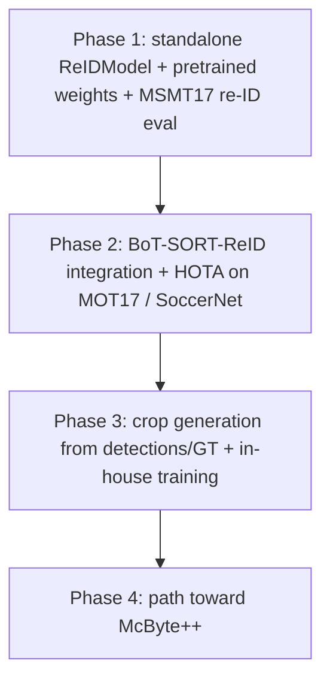

# RFC 0001: Re-ID Feature for `trackers`

- **Status:** Draft (for team review)
- **Authors:** Roboflow trackers team
- **Reviewers:** Tomasz Stanczyk, Alexander Bodner, Jiri (jirka)
- **Created:** 2026-06-15
- **Target package version:** `trackers` (current `2.4.0`)
- **License context:** Core package is Apache-2.0 (`pyproject.toml`); any pretrained weights / external deps must be license-compatible.

---

## 0. TL;DR

We want to add a **standalone appearance re-identification (re-ID)** capability to
`trackers`, starting simple and based only on bounding boxes (not the full McByte++
approach yet). This RFC:

1. Reviews the SOTA in person re-ID and the two architectures Tomasz proposed
  (FastReID, TorchReID/OSNet).
2. Compares the candidate **encoder architectures**, **tracker-side integration
  strategies**, and **dependency-sourcing options** in three structured tables,
   each rated for implementation complexity.
3. Recommends a first-release architecture.
4. Specifies a **proper re-ID evaluation protocol** (query/gallery retrieval with
  Rank-N + mAP) on **MSMT17**, with target numbers close to the published papers,
   so we can guarantee correctness and integrity before shipping.

**Headline recommendation:** Ship a standalone `ReIDModel` (timm-backed, exposed
behind an optional `[reid]` extra) defaulting to **OSNet** pretrained on MSMT17,
with **FastReID SBS (ResNet50-ibn)** as an optional higher-accuracy profile.
Validate it with a dedicated MSMT17 re-ID evaluator that reproduces
**OSNet ~43.8 mAP / 74.9 Rank-1** (standard split, torchreid model zoo) and **FastReID SBS R50-ibn ~65.4 mAP / 85.1 Rank-1**.
Integrate appearance into tracking first via **BoT-SORT-ReID** (reuses the existing
BoT-SORT + CMC + `frame` path). Defer transformer SOTA (TransReID/SOLIDER) to a
later release.

---

## 1. Problem framing & scope

### 1.1 What we are building (now)

A standalone appearance re-ID component for bounding-box-based multi-object tracking
(MOT). Concretely, an **appearance encoder** that turns a detection crop into an
embedding vector, plus the machinery to use those embeddings during data
association so identities survive occlusions, missed detections, and crossings that
geometry (IoU) and motion (Kalman) alone cannot resolve.

This is intentionally **simpler than McByte++**: a clean, well-evaluated standalone
re-ID solution that we can ship and benchmark, and on top of which McByte++ can be
built later.

### 1.2 Release staging

- **First release:** pretrained models only (no in-house training required by the
user). Models pretrained on re-ID datasets (MSMT17) or tracking datasets
(MOT17, SoccerNet, SoccerNet-reID).
- **Later releases:** give users the ability to generate crops from tracking
datasets (from detections or ground-truth boxes) and train their own weights.
The original BoT-SORT does exactly this for patch generation
(`niraharon/bot-sort#data-preparation`).

### 1.3 Re-ID evaluation is NOT tracking evaluation

This is a core point Alexander raised and it must be reflected in the design.

- **Tracking evaluation** (already in [src/trackers/eval](../src/trackers/eval)):
HOTA, CLEAR (MOTA/MOTP), Identity (IDF1) over video sequences with temporal
identity continuity.
- **Re-ID evaluation** (new, this RFC): a **retrieval** task. Given an *anchor*
(query) image of an object and a *gallery* of many images, retrieve the top-N
gallery images of the same identity. Scored with **CMC Rank-N** and **mAP**.

Example (from Tomasz/Alex framing): the anchor is a photo of Tomasz; the gallery
contains many photos of Tomasz, Alex, and Jiri. The re-ID model should retrieve the
top-10 photos most similar to the Tomasz anchor, and we measure how many of the true
Tomasz photos appear and how highly they rank.

These two evaluations are complementary: a strong re-ID model should both score well
on MSMT17 retrieval AND improve HOTA/IDF1 when plugged into a tracker. We need both
to claim integrity.

### 1.4 Prior art in this repo (clean slate, but recoverable)

- The library is `supervision.Detections`-native. Every tracker shares
`BaseTracker.update(detections, frame=None)`
([src/trackers/core/base.py](../src/trackers/core/base.py)). The `frame` argument
is already part of the contract but is currently only consumed by BoT-SORT (for
camera motion compensation, CMC).
- There is currently **no** appearance/re-ID stack. DeepSORT and the old
`ReIDModel` were **removed in v2.1.0** (see [CHANGELOG.md](../CHANGELOG.md)).
- The previous design is recoverable from git at
`516c9934:trackers/core/reid/model.py`: a timm-backed `ReIDModel` with
`extract_features(detections, frame) -> np.ndarray` (crops each bbox, runs the
backbone), a `from_timm(...)` constructor, and a later `from_torchreid(...)`
loader, all behind an optional `[reid]` extra (`timm`, `safetensors`, plus
`torch`/`torchvision`).
- **Core philosophy** (README, `pyproject.toml`): clean-room re-implementations,
detector-agnostic, lightweight core. `torch` is **not** a runtime dependency
today (it lives only in the dev group and a CLI device helper). Any re-ID design
must preserve the lightweight-core guarantee.

---

## 2. Background: what a re-ID component actually is

A re-ID model is an **appearance encoder** `f: image_crop -> R^d`. It is trained so
that crops of the **same identity** map to nearby vectors and crops of **different
identities** map to distant vectors, under a chosen distance (typically cosine on
L2-normalized embeddings, or Euclidean).

Two distinct uses:

1. **Retrieval / evaluation:** embed a query and a gallery, rank gallery by distance
  to the query. This is the MSMT17 benchmark task (Section 7).
2. **Tracking association:** at each frame, embed every detection crop. For each
  (track, detection) pair, compute an **appearance distance**. Fuse it with the
   geometric/motion cost (IoU + Kalman gating) into a single cost matrix solved by
   the Hungarian algorithm (`scipy.optimize.linear_sum_assignment`, already used
   across the trackers). Track embeddings are usually maintained as an
   **exponential moving average (EMA)** (a "feature bank") so they stay stable
   across frames.

The encoder is the same object in both cases; only the consumer differs. This is why
we evaluate the encoder standalone on MSMT17 (integrity / correctness) *and* in a
tracker (end task).

---

## 3. Comparative Table A — appearance encoder architectures

Numbers are on **MSMT17** (the hardest of the common person re-ID benchmarks: 4,101
identities, 126k+ images, 15 cameras), reported as **mAP / Rank-1**. "Impl.
complexity" rates the effort to reach paper-level numbers *in this repo* (training +
integration), not merely to call the model.

| Method                                                                  | Core idea                                                                                                                                                                                                          | Backbone / size                        | MSMT17 mAP / R1                     | Pretrained weights                                   | Impl. complexity                                         | Real-time fit         |
| ----------------------------------------------------------------------- | ------------------------------------------------------------------------------------------------------------------------------------------------------------------------------------------------------------------ | -------------------------------------- | ----------------------------------- | ---------------------------------------------------- | -------------------------------------------------------- | --------------------- |
| **BoT "Bag of Tricks"** (Luo et al., CVPRW'19)                          | A ResNet50 baseline made strong with a curated set of tricks: BNNeck, warmup LR, random erasing, label smoothing, center loss. The conceptual ancestor of FastReID's strong baseline.                              | ResNet50 (~25M)                        | ~50 / 74                            | Various (re-derivable)                               | **Medium** — clean-room friendly, well-documented tricks | Medium                |
| **OSNet / OSNet-AIN** (Zhou et al., ICCV'19; TorchReID)                 | "Omni-scale" residual blocks aggregate features across multiple receptive-field scales with a unified aggregation gate; extremely lightweight. *Tomasz's torchreid option.*                                        | OSNet (~2.2M)                          | **43.8 / 74.9** (standard split, torchreid model zoo; paper reports 52.9 / 78.7 on a different protocol) | Yes — TorchReID model zoo + HF (`kaiyangzhou/osnet`) | **Low** to consume / **Medium** clean-room               | **Best** (tiny, fast) |
| **FastReID strong baselines** — SBS / AGW / MGN (He et al., '20; JD AI) | A production toolbox of strong baselines: SBS (stronger-baseline tricks), AGW (attention + generalized-mean pooling + weighted triplet), MGN (multi-granularity part-based branches). *Tomasz's fast-reid option.* | ResNet50 / R50-ibn / ResNeSt (~25-45M) | up to **65.4 / 85.1** (SBS R50-ibn) | Yes — FastReID model zoo                             | **High** framework / **Medium** inference                | Medium (R50 class)    |
| **TransReID** (He et al., ICCV'21)                                      | First strong pure-transformer re-ID: ViT-B/16 + Jigsaw Patch Module (JPM) for robustness + Side Information Embedding (SIE) for camera/viewpoint.                                                                  | ViT-B/16 (~86M)                        | ~67 / 85                            | Yes (ImageNet-21k pretrain)                          | **High**                                                 | Low (heavy)           |
| **SOLIDER** (Swin, CVPR'23) / **PersonMAE**, **PersonViT** (2024)       | Self-supervised pretraining on the large unlabeled **LUPerson** corpus (DINO / masked image modeling), then supervised re-ID fine-tune. Current SOTA.                                                              | Swin / ViT-B (~50-90M)                 | up to **~77-81 / ~91-92**           | Yes (research releases)                              | **Very High** (large-scale SSL pretrain)                 | Low (heavy)           |

**Reading of Table A:**

- **OSNet** is the sweet spot for a real-time tracker: ~10x fewer params than a
ResNet50, MSMT17 mAP within ~3 points of a ResNet50 strong baseline, and
ready-to-use MSMT17 weights.
- **FastReID SBS (R50-ibn)** is the accuracy ceiling among CNN options and is the
right "quality profile" for users who can afford a ResNet50-class encoder.
- **Transformers (TransReID / SOLIDER / PersonViT)** lead the leaderboard but are
heavy, slower at inference, and far more complex to train/maintain — overkill for
a first standalone release.

---

## 4. Comparative Table B — tracker-side appearance integration

How the encoder's embeddings get *used* during tracking. This is a separate axis from
"which encoder" (Table A): any encoder can drive any of these.

| Strategy                                     | Core idea                                                                                                                                                                                                                                      | Fit with current repo                                                                                                                                                               | Impl. complexity |
| -------------------------------------------- | ---------------------------------------------------------------------------------------------------------------------------------------------------------------------------------------------------------------------------------------------- | ----------------------------------------------------------------------------------------------------------------------------------------------------------------------------------- | ---------------- |
| **DeepSORT** (revive)                        | Appearance feature bank per track + Mahalanobis motion gating + a "matching cascade" that prioritizes recently-seen tracks.                                                                                                                    | New tracker; mirrors the design removed in v2.1.0 (recoverable from git).                                                                                                           | **Medium**       |
| **BoT-SORT-ReID** (extend existing BoT-SORT) | Fuse IoU cost and appearance (cosine) cost into a single association cost; EMA-update track features; combine with the camera motion compensation BoT-SORT already does. This is what the original BoT-SORT paper does in its "-ReID" variant. | **Strong** — `BoTSORTTracker` already exists ([src/trackers/core/botsort](../src/trackers/core/botsort)) and already consumes `frame` for CMC. Appearance is an additive cost term. | **Low-Medium**   |
| **StrongSORT / Deep OC-SORT** (later)        | Refinements over DeepSORT/OC-SORT: EMA feature updates, AFLink (offline link), Gaussian-smoothed interpolation, camera-motion-aware embedding update.                                                                                          | Build on whichever base lands first; OC-SORT already in repo.                                                                                                                       | **Medium-High**  |

**Reading of Table B:** Integrating appearance into **BoT-SORT** first is the lowest-
friction path because the tracker, its CMC, and the `frame=` plumbing already exist;
appearance becomes one more term in the cost matrix. DeepSORT revival is a reasonable
secondary deliverable (it is the canonical "re-ID + tracking" reference and is good
for documentation/teaching). StrongSORT / Deep OC-SORT are follow-on enhancements.

---

## 5. Comparative Table C — dependency / sourcing options

This is the dimension Alexander flagged: we want a **clean, complete** library, so we
must weigh every realistic sourcing option against the "clean-room, lightweight core"
principle rather than defaulting to the easiest one.

| Option                                                                                | What it means                                                                                                                                                                                                               | Pros                                                                                                                                | Cons                                                                                                                                                       | Ethos fit         |
| ------------------------------------------------------------------------------------- | --------------------------------------------------------------------------------------------------------------------------------------------------------------------------------------------------------------------------- | ----------------------------------------------------------------------------------------------------------------------------------- | ---------------------------------------------------------------------------------------------------------------------------------------------------------- | ----------------- |
| **A. Standalone `ReIDModel` on timm + `from_torchreid` loader** (recommended)         | Re-introduce the v2.1.0-style `ReIDModel`: timm backbones for architecture, with loaders that can ingest TorchReID/FastReID pretrained weights. Exposed behind an optional `[reid]` extra (`torch`, `torchvision`, `timm`). | Keeps `torch` optional (lightweight core preserved); single small surface area; users pick weights; we own the inference/eval code. | We maintain a model + weight-loading layer; must validate each weight source reproduces paper numbers.                                                     | **Best**          |
| **B. Hard dependency on / thin wrapper around `torchreid`**                           | `pip install torchreid` becomes (optional) required; we call its model zoo + eval directly.                                                                                                                                 | Fastest path to paper numbers; OSNet weights + CMC/mAP eval come for free.                                                          | A thin wrapper (conflicts with "clean-room, not a wrapper" promise); heavy transitive deps; less control over API surface.                                 | Weak              |
| **C. Wrapper around `fast-reid`**                                                     | Depend on the FastReID toolbox for models + zoo.                                                                                                                                                                            | Highest CNN accuracy; many architectures.                                                                                           | Large detectron2-style framework + config system; heavyweight; wrapper ethos problem; maintenance burden.                                                  | Weak              |
| **D. Full clean-room reimplementation** (e.g. OSNet from the paper, trained in-house) | Re-implement one architecture and training recipe from scratch, train our own weights, no external re-ID lib.                                                                                                               | Maximal control + perfect ethos alignment; we can publish our own weights.                                                          | Highest effort; reproduction risk (note: even the OSNet author's repo has open issues about reproducing MSMT17 numbers exactly); slowest to first release. | Strong (but slow) |

**Reading of Table C:** Option **A** threads the needle: we keep `torch` optional
(so the default `pip install trackers` stays lightweight), we own the
inference/evaluation code (clean-room for *our* logic, not a wrapper around someone's
training loop), and we can still consume well-known pretrained weights so the first
release ships with credible numbers fast. Option **D** is the long-term "purest" path
and aligns with the README's clean-room promise — it is the natural Phase 3 once
crop-generation + training land (Section 8), at which point we can train and publish
Roboflow weights and drop the external weight dependency.

---

## 6. Recommendation

1. **Encoder (Table A):** default to **OSNet** (MSMT17-pretrained) for the
  accuracy/speed/footprint balance that real-time MOT needs; offer **FastReID SBS
   (ResNet50-ibn)** as an optional higher-accuracy profile.
2. **Sourcing (Table C):** **Option A** — re-introduce a standalone `ReIDModel`
  (timm-backed) behind an optional `[reid]` extra, with `from_torchreid` /
   weight-loading constructors. Keep `torch` strictly optional so the core stays
   lightweight.
3. **Tracker integration (Table B):** **BoT-SORT-ReID first** (reuses BoT-SORT +
  CMC + the existing `frame=` path), with DeepSORT revival as a documented
   secondary option.
4. **Defer** transformer SOTA (TransReID / SOLIDER / PersonViT) to a later release;
  revisit once the standalone re-ID + integration + evaluation foundation is solid.

Rationale: this maximizes "credible numbers shipped quickly" while preserving the
library's identity (lightweight core, clean-room logic, detector-agnostic), and it
sets up the later in-house-training path cleanly.

---

## 7. Re-ID evaluation protocol (integrity / correctness)

This section is the heart of the "measure it properly" requirement. We must be able
to take an encoder and reproduce published MSMT17 numbers before we trust it inside a
tracker.

### 7.1 Datasets

- **MSMT17** — primary target. Largest and hardest common person re-ID benchmark
(4,101 IDs, 126k+ bounding boxes, 15 cameras, indoor/outdoor, multiple times of
day). Requires accepting its license / access terms — flag this for legal/compat.
- **Market-1501** — secondary sanity dataset (smaller, faster to iterate; well-known
baseline numbers). Useful for catching protocol bugs cheaply.
- **DukeMTMC-reID** — historically standard but **deprecated/withdrawn**; do not use
for new releases.
- **SoccerNet-reID** — domain-relevant follow-up (sports), good for the tracking
story; not needed for the first MSMT17 reproduction milestone.

### 7.2 Protocol (standard query/gallery retrieval)

1. Split the test set into **query** (anchors) and **gallery** images (datasets ship
  this split).
2. Extract an embedding for every query and gallery crop; **L2-normalize**.
3. Compute the query x gallery distance matrix (**cosine** distance recommended;
  Euclidean supported for parity with some papers).
4. For each query, sort the gallery by ascending distance.
5. Apply the **standard junk rule**: when scoring a query, exclude gallery items that
  share **both** the same identity **and** the same camera as the query (these are
   trivial same-camera matches), and ignore distractor/junk items per the dataset's
   protocol.
6. Aggregate metrics across all queries.

### 7.3 Metrics

- **CMC Rank-1 / Rank-5 / Rank-10** (Cumulative Matching Characteristics): the
probability that a correct match appears within the top-N retrieved gallery items.
Rank-1 = "is the very top retrieval correct?".
- **mAP** (mean Average Precision): averages precision across **all** correct matches
for each query, then over queries. Rewards retrieving *all* instances of the
identity highly, not just one — the more complete picture.
- **mINP** (mean Inverse Negative Penalty, optional): penalizes how far down the
hardest correct match sits; complements mAP.

Worked example (Tomasz/Alex framing): anchor = a photo of Tomasz; gallery = many
photos of Tomasz, Alex, Jiri. Retrieve top-10. **Rank-1** asks whether the single
closest gallery photo is Tomasz; **Rank-10** whether *any* Tomasz photo is in the top
10; **mAP** rewards ranking *all* Tomasz photos above the Alex/Jiri photos.

### 7.4 Reproduction targets

Numbers we should land within tolerance of (mAP / Rank-1 on MSMT17):

- **OSNet (osnet_x1_0):** ~**43.8 mAP / 74.9 Rank-1** (standard split, torchreid
  model zoo). The paper reports 52.9 / 78.7 on a different (non-standard) split.
  **Important:** the library default (`osnet_x1_0_msmt17_combineall`) trains on the
  MSMT17 test identities and must **not** be used to benchmark MSMT17 — use the
  standard-split checkpoint (`osnet_x1_0_msmt17`) for evaluation.
- **FastReID SBS (ResNet50-ibn):** ~**65.4 / 85.1**.

Caveat to document: exact reproduction can vary by a couple of points with seed,
distance metric (cosine vs Euclidean), and weight provenance (the OSNet author's repo
has open issues about reproducing MSMT17 exactly). We target "within a small,
documented tolerance of reported," and we record the exact config used.

### 7.5 Tooling implication

This needs a **new re-ID evaluator** distinct from the tracking metrics in
[src/trackers/eval](../src/trackers/eval) (which compute HOTA/CLEAR/Identity over
sequences). The re-ID evaluator operates on query/gallery image sets and produces
CMC + mAP. (Implementation lands in a later phase; this RFC only specifies it.)

---

## 8. Phased roadmap

- **Phase 1 (foundation):** standalone `ReIDModel` (Option A), pretrained OSNet /
FastReID weights, and the MSMT17 re-ID eval harness reproducing the Section 7.4
numbers. Deliverable proof: a results table close to the papers.
- **Phase 2 (use it):** BoT-SORT-ReID integration; measure HOTA/IDF1 uplift on
MOT17 and SoccerNet vs the appearance-free baseline.
- **Phase 3 (own it):** user crop-generation from tracking datasets (detections or
GT boxes), BoT-SORT-style patch prep, and in-house training so users (and we) can
train weights on MSMT17 / SoccerNet-reID. Enables publishing Roboflow weights and
moving toward clean-room Option D.
- **Phase 4:** build McByte++ on top of the proven standalone re-ID foundation.

---

## 9. Open questions for the team

1. **Default weights source:** TorchReID HF (`kaiyangzhou/osnet`) vs FastReID zoo —
  confirm license compatibility with Apache-2.0 distribution and how we host/cache
   weights.
2. **Dependency policy:** confirm `torch` / `torchvision` / `timm` stay **optional**
  (the `[reid]` extra), preserving the lightweight default install.
3. **Embedding defaults:** embedding dimension, distance metric (cosine default?),
  and EMA momentum for the tracker feature bank.
4. **Generality beyond persons:** do we commit to person-only re-ID for v1, or design
  the `ReIDModel` API to be class-agnostic (vehicles, athletes, generic objects)
   from the start?
5. **Eval surface:** does the new re-ID evaluator live under `trackers eval`
  (extending the CLI) or as a separate `trackers reid-eval` command / module?
6. **First integration target:** BoT-SORT-ReID only, or BoT-SORT-ReID **and**
  DeepSORT revival in the same release?

---

## 10. Out of scope (this RFC)

No code, no dependency changes, no tracker edits are made by this document. It is a
decision artifact. Implementation begins once the architecture + sourcing decisions
(Sections 4-6) and the evaluation protocol (Section 7) are approved.

---

## References

- FastReID: *FastReID: A PyTorch Toolbox for General Instance Re-identification*,
arXiv:2006.02631; repo `JDAI-CV/fast-reid`.
- TorchReID / OSNet: *Omni-Scale Feature Learning for Person Re-Identification*,
ICCV'19, arXiv:1905.00953 (library), arXiv:1910.06827 (OSNet); repo
`KaiyangZhou/deep-person-reid`; weights `huggingface.co/kaiyangzhou/osnet`.
- BoT "Bag of Tricks": *Bag of Tricks and a Strong Baseline for Deep Person
Re-Identification*, CVPRW'19.
- TransReID: *TransReID: Transformer-based Object Re-Identification*, ICCV'21.
- SOLIDER: *Beyond Appearance: a Semantic Controllable Self-Supervised Learning
Framework*, CVPR'23; repo `tinyvision/SOLIDER-REID`.
- PersonViT: *PersonViT: Large-scale Self-supervised ViT for Person Re-ID*,
arXiv:2408.05398.
- BoT-SORT (patch generation / data preparation): `niraharon/bot-sort`.
- SoccerNet re-ID task: [https://www.soccer-net.org/tasks/re-identification](https://www.soccer-net.org/tasks/re-identification)
- Prior in-repo design (removed v2.1.0): git `516c9934:trackers/core/reid/model.py`.

